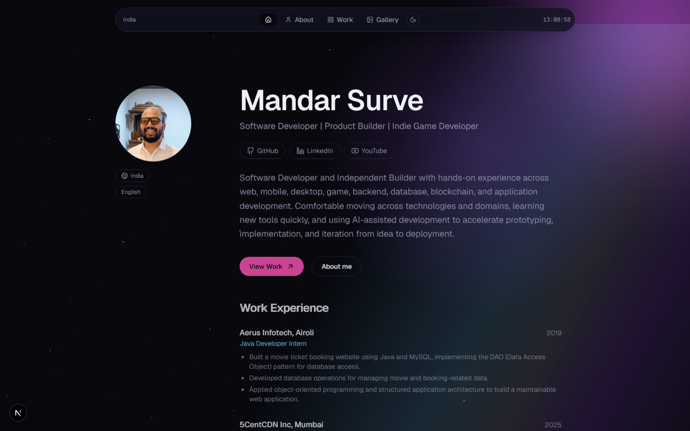
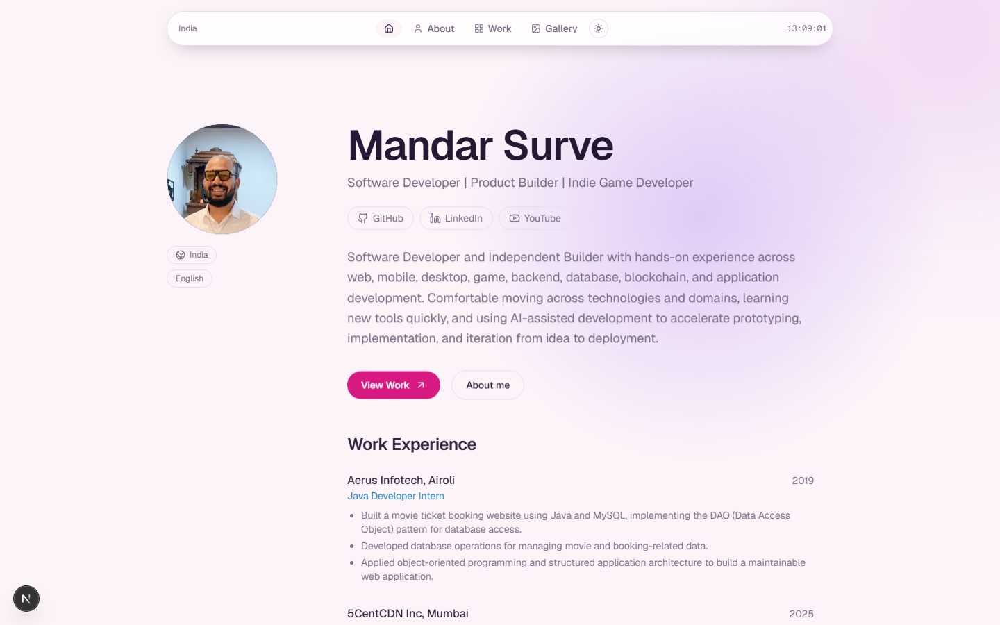
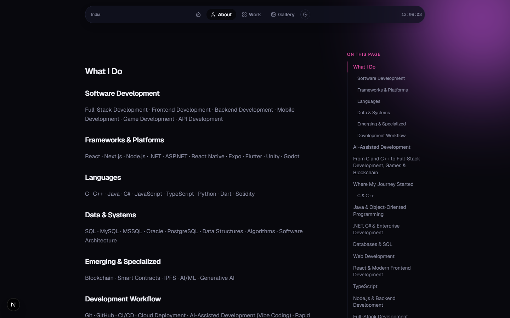
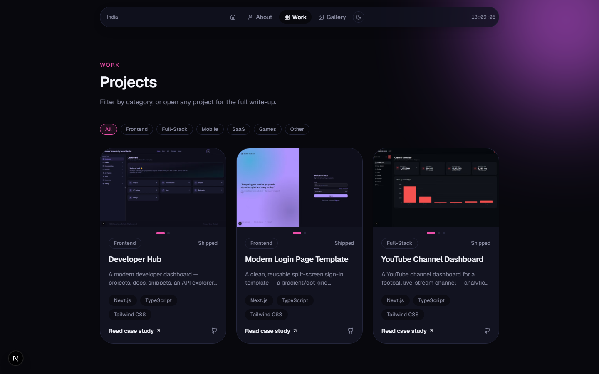
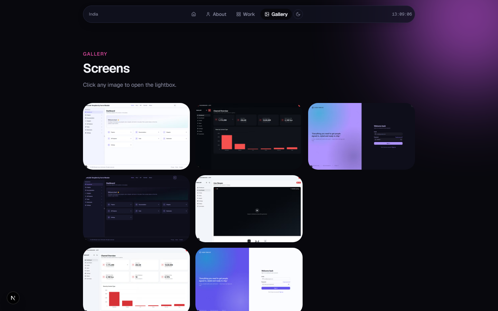

<div align="center">

# 🧑‍💻 Mandar Surve — Portfolio

A **personal portfolio site** for a software developer working across web, mobile, backend, and games — built with **Next.js**, **TypeScript**, and **Tailwind CSS v4**, with real projects, real work history, and MDX-driven content.

[](https://nextjs.org)
[](https://react.dev)
[](https://www.typescriptlang.org)
[](https://tailwindcss.com)
[](https://mdxjs.com)

</div>

---

## 📸 Preview

<table>
<tr>
<td align="center" width="50%"><b>Home — Dark</b><br></td>
<td align="center" width="50%"><b>Home — Light</b><br></td>
</tr>
<tr>
<td align="center" width="50%"><b>About</b><br></td>
<td align="center" width="50%"><b>Work</b><br></td>
</tr>
<tr>
<td align="center" colspan="2"><b>Gallery</b><br></td>
</tr>
</table>

## ✨ Features

- 🏠 **Home** — profile hero with circular-reveal project carousel, a real work-experience timeline, and an animated skills grid grouped by category
- 📖 **About** — long-form MDX journey narrative with a scroll-spy table of contents that tracks the active heading as you read
- 💼 **Work** — filterable project grid (by category) backed by real repos, each with a full MDX case-study page
- 🖼️ **Gallery** — masonry image grid with a keyboard-navigable lightbox
- 🌗 **Full light/dark theming** — every surface, including the animated hero background, switches cleanly via CSS custom properties
- ✨ **Milky Way hero background** — seeded twinkling starfield and cursor-reactive glow, auto-hidden in light theme so it never looks like stray dots
- 🔗 **Dynamic OG images & favicon** — social share previews and the favicon are generated on the fly with `next/og`, no static assets
- 🛡️ **Right-click / copy deterrents** — site-wide context-menu and image-drag protection (a deterrent, not real DRM — nothing client-side can block OS-level screenshots)
- 🏃 **A small easter egg** — right-click the profile photo and see what happens

## 🛠 Installation & Setup

```bash
git clone https://github.com/Fawkes73/new-portfolio-site.git
cd new-portfolio-site
npm install
npm run dev
```

Visit **http://localhost:3000**.

## 📂 Project Structure

| Path | Purpose |
|---|---|
| `app/` | Route segments (Home, About, Work, Work/[slug], Gallery) plus favicon, OG image, sitemap, and robots routes |
| `components/hero/` | Home page hero: profile card, work experience, skills, featured project |
| `components/about/` | Table of contents and animated skill bars |
| `components/projects/` | Project cards and the circular-reveal image carousel |
| `components/gallery/` | Masonry grid and lightbox |
| `components/layout/` | Header, footer, theme toggle, site background, clock |
| `content/` | MDX source for the About page and each project case study |
| `config/site.ts` | Single source of truth for name, links, nav, and work experience |
| `lib/` | MDX pipeline, table-of-contents extraction, project/gallery/skills data loaders |

## 🚀 Tech Stack

- [Next.js](https://nextjs.org/) 16 (App Router) – React framework for production
- [React](https://react.dev/) 19 & [TypeScript](https://www.typescriptlang.org/)
- [Tailwind CSS v4](https://tailwindcss.com/) – Utility-first, CSS-first config
- [next-themes](https://github.com/pacocoursey/next-themes) – Dark/light/system theming
- [next-mdx-remote](https://github.com/hashicorp/next-mdx-remote) + `rehype-pretty-code` / `shiki` – MDX rendering with syntax-highlighted code blocks
- [Lucide](https://lucide.dev/) – Icons

## 🔗 Connect

- GitHub: [@Fawkes73](https://github.com/Fawkes73)
- YouTube: [@codingmarathiyt](https://www.youtube.com/@codingmarathiyt)
